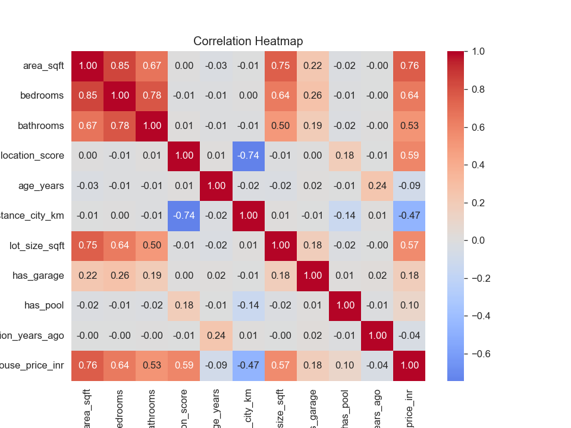
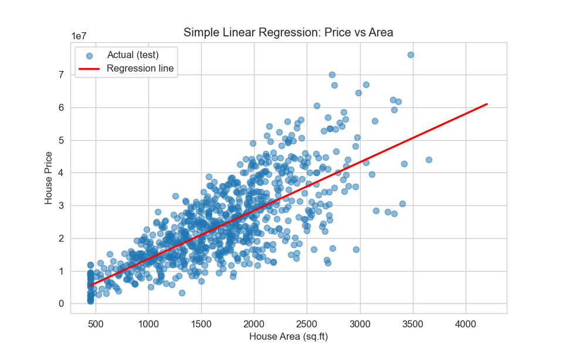
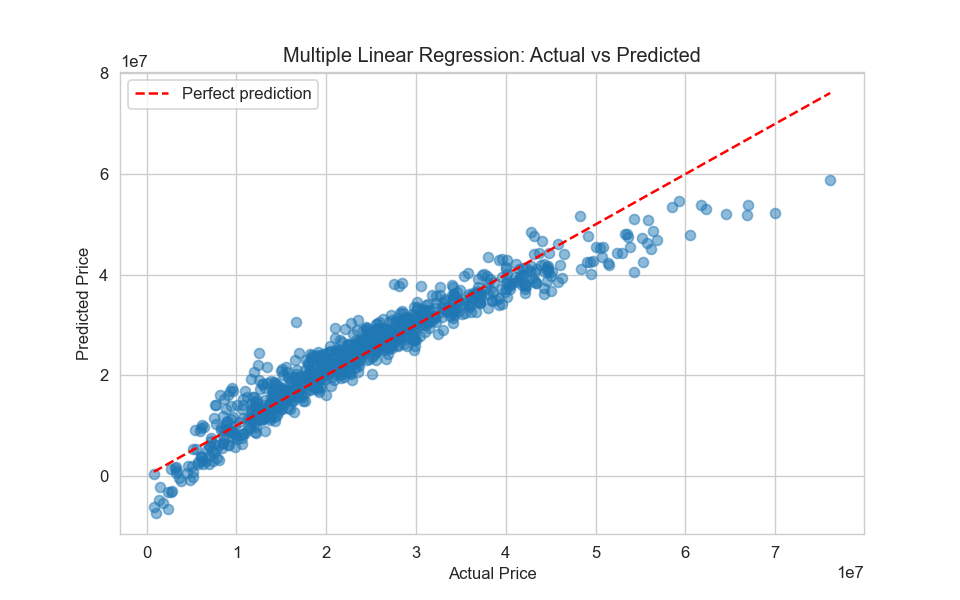
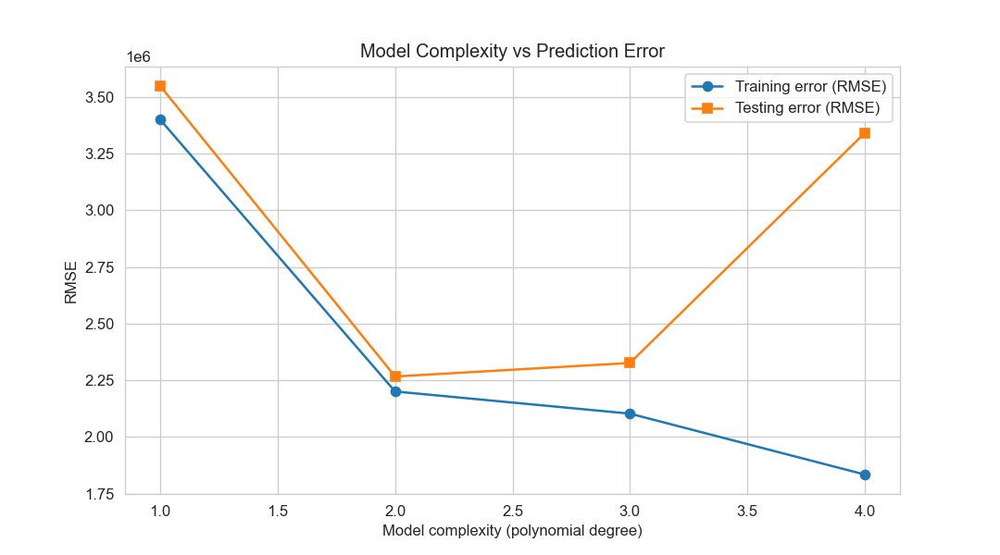
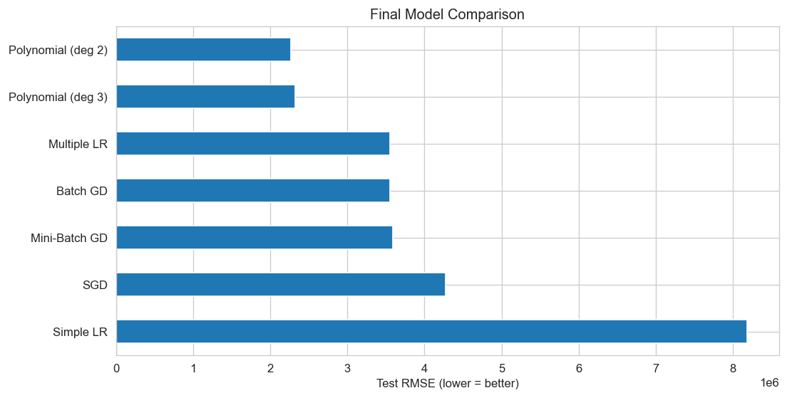
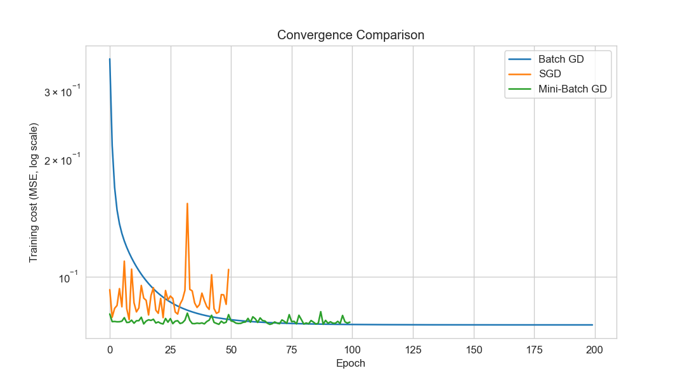

<div align="center">

# 🏠 Predictive Insight Engine

### Predicting house prices with Supervised Learning

*Simple, Multiple and Polynomial Regression, plus Gradient Descent written from scratch*


</div>

---

## 👋 About this project

Hi, I'm **Bhavy**, a  AIML student at Red and White Skill Education Nikol, Ahmedabad. This is my Supervised Learning project.

The task was to act like a junior data scientist at a real estate company and build a system that predicts the price of a house from things like its area, rooms, location and age. Along the way I had to compare different regression models and explain *why* one works better than another, not just show a score.

I started with the simplest possible model (one feature, one straight line) and kept adding ideas until the error dropped from about **₹82 lakh to about ₹23 lakh**. I also wrote Batch, Stochastic and Mini-Batch Gradient Descent by hand, without sklearn, to see what is really happening inside `.fit()`.


---

## 📑 Table of contents

1. [The dataset](#-the-dataset)
2. [How the notebook is organised](#-how-the-notebook-is-organised)
3. [Libraries used and why](#-libraries-used-and-why)
4. [Results](#-results)
5. [Graphs I liked the most](#-graphs-i-liked-the-most)
6. [Gradient Descent from scratch](#-gradient-descent-from-scratch)
7. [Things I noticed](#-things-i-noticed)
8. [Video explanation](#-video-explanation)

---

## 📊 The dataset

The dataset has **4,200 houses**, no missing values, and 11 columns. `house_id` is just a label, so I dropped it. That leaves 10 features and one target.

| Column | What it means |
|---|---|
| `area_sqft` | Built-up area of the house |
| `bedrooms` | Number of bedrooms |
| `bathrooms` | Number of bathrooms |
| `location_score` | Score from 1 to 10 for how good the location is |
| `age_years` | Age of the property |
| `distance_city_km` | Distance from the city centre |
| `lot_size_sqft` | Size of the plot |
| `has_garage` | 1 if there is a garage, else 0 |
| `has_pool` | 1 if there is a pool, else 0 |
| `renovation_years_ago` | Years since the last renovation |
| **`house_price_inr`** | **Target: price of the house in rupees** |

The average price in the data is about ₹2.36 crore. I used an **80/20 split** (3,360 rows for training, 840 for testing) with `random_state=42`, so the numbers are the same every time you run it.

---

## 🧭 How the notebook is organised

The notebook follows the assignment parts in order, so it is easy to match each question with its answer.

| Part | Questions | What I did |
|:---:|:---:|---|
| **A** | 1 to 6 | Theory answers: supervised learning, regression vs classification, simple linear regression, assumptions, bias-variance, overfitting and underfitting |
| **B** | 7 to 9 | Loaded and cleaned data, picked X and y, made scatter plots and a heatmap, train/test split |
| **C** | 10 to 12 | Simple Linear Regression on `area_sqft`, regression line, checked the assumptions with plots |
| **D** | 13 to 14 | MSE, MAE, RMSE, R² and Adjusted R², with an explanation of each |
| **E** | 15 to 17 | Multiple Linear Regression with all 10 features and comparison with Part C |
| **F** | 18 to 20 | Polynomial Regression (degree 2 and 3), visual and numeric comparison, overfitting check |
| **G** | 21 to 25 | Batch GD, SGD and Mini-Batch GD from scratch, and their comparison |
| **H** | 26 to 28 | Bias and variance of each model, complexity vs error, best balanced model |
| **I** | 29 to 30 | Final table, short report and conclusion |

---

## 🧰 Libraries used and why

I tried to keep the toolset small. Here is everything the notebook imports and what I needed it for.

| Library | What I used it for |
|---|---|
| **NumPy** | Arrays and maths. The whole Gradient Descent code is written with NumPy (matrix multiplication, shuffling, adding the bias column), and I also used it for the bootstrap in the bias-variance part |
| **pandas** | Reading the CSV, `info()` / `describe()`, checking missing values and duplicates, and building the result tables. Also used to save `model_evaluation_results.csv` |
| **Matplotlib** | Every graph in the project (regression line, residual plots, convergence curves, bar charts) and saving them to `plots/` |
| **Seaborn** | The prettier plots: scatter plots, the correlation heatmap and histograms with a smooth curve |
| **SciPy** (`scipy.stats`) | The Q-Q plot (`probplot`) and the Shapiro-Wilk normality test for the assumption checks |
| **scikit-learn** | `train_test_split` for the split, `LinearRegression` for Simple, Multiple and Polynomial models, `PolynomialFeatures` to create the x², x³ terms, `StandardScaler` for scaling, `make_pipeline` to chain these steps, `cross_val_score` for 5-fold cross-validation, and the `metrics` module for MSE, MAE and R² |
| **os** *(built-in)* | Checking that the CSV exists and creating the `plots/` folder |
| **time** *(built-in)* | Measuring how long each Gradient Descent method takes |
| **warnings** *(built-in)* | Hiding warning messages so the output stays clean |
| **Jupyter Notebook** | Running code, graphs and written explanations together in one file |

To install everything in one go:

```bash
pip install numpy pandas matplotlib seaborn scipy scikit-learn notebook
```

---

## 🏆 Results

All numbers below are on the **test set** (840 houses the model never saw during training).

| Rank | Model | RMSE (₹) | MAE (₹) | R² | Adj. R² |
|:---:|---|---:|---:|:---:|:---:|
| 🥇 | **Polynomial Regression (degree 2)** | **2,267,045** | 1,656,923 | **0.966** | **0.964** |
| 2 | Polynomial Regression (degree 3) | 2,326,734 | 1,707,651 | 0.965 | 0.946 |
| 3 | Multiple Linear Regression | 3,548,650 | 2,604,991 | 0.918 | 0.917 |
| 4 | Batch Gradient Descent | 3,549,154 | 2,605,251 | 0.918 | 0.917 |
| 5 | Mini-Batch Gradient Descent | 3,589,179 | 2,650,620 | 0.916 | 0.915 |
| 6 | Stochastic Gradient Descent | 4,275,429 | 3,166,322 | 0.881 | 0.879 |
| 7 | Simple Linear Regression | 8,184,697 | 6,294,594 | 0.563 | 0.562 |


- Using only the area (Simple LR) explains just 56% of the price changes. Adding the other 9 features (Multiple LR) jumps this to 92%.
- Degree 2 polynomial is the winner. It brings the typical error to about ₹22.7 lakh, roughly **10% of the average price**.
- Degree 3 is a little worse than degree 2, and its Adjusted R² drops to 0.946. More complexity did not help.
- Cross-validation agrees with the single split: R² of 0.569 (Simple), 0.923 (Multiple), 0.967 (Poly 2) and 0.964 (Poly 3).

**What affects the price the most** (from the Multiple Regression coefficients, other features kept constant): a better `location_score` adds the most (about ₹30.7 lakh per point), while more `age_years` and more `distance_city_km` bring the price down.

---

## 📈 Graphs I liked the most

**1. Correlation heatmap.** Area has the strongest link with price (0.76). It also shows that area, bedrooms and bathrooms are strongly related to each other, which is why the coefficients of Multiple LR need to be read carefully.

<p align="center">
  
</p>

**2. Simple Linear Regression.** One line through the cloud of houses. It gets the general trend but misses a lot.

<p align="center">
  
</p>

**3. Multiple Linear Regression, actual vs predicted.** Points hug the red line, so the model tracks prices well. It under-predicts the most expensive houses.

<p align="center">
  
</p>

**4. Model complexity vs error.** This is the classic overfitting picture. Training error keeps falling, but the test error goes down until degree 2 and then shoots up at degree 4.

<p align="center">
  
</p>

**5. Final comparison of all models.**

<p align="center">
  
</p>

The remaining graphs (price distribution, residual checks, bias-variance chart and others) are all in the [`plots/`](plots) folder.

---

## ⚙️ Gradient Descent from scratch

Instead of only calling sklearn, I coded the three versions myself. The idea is the same in all of them: check the slope of the error, take a small step downhill, repeat. The only difference is how many rows are used for each step.

```python
def batch_gd(X, y, lr=0.1, epochs=200):
    m, n = X.shape
    theta = np.zeros(n)
    history = []
    for _ in range(epochs):
        grad = (2 / m) * X.T @ (X @ theta - y)
        theta -= lr * grad
        history.append(mse_cost(X, y, theta))
    return theta, history
```

I scaled the features first, because without scaling the big columns (area, lot size) dominate and it converges very slowly.

| Method | Rows per update | Epochs | Time | Test RMSE (₹) |
|---|---|:---:|:---:|---:|
| Batch GD | all 3,360 | 200 | 0.04 s | 3,549,154 |
| Mini-Batch GD | 32 | 100 | 0.29 s | 3,589,179 |
| SGD | 1 | 50 | 1.96 s | 4,275,429 |
| *sklearn Multiple LR (exact answer)* | - | - | - | *3,548,650* |

Batch GD ends up almost exactly on the sklearn answer, so my implementation is correct. Mini-Batch is close behind and much faster at the start. SGD is noisy and needs a smaller learning rate to settle nicely.

<p align="center">
  
</p>

---

## 🔍 Things I noticed

Not everything was perfect, and I think it is better to say so.

- **Residuals are not perfectly even.** In the residual plot the spread widens for expensive houses (a mild funnel shape), so the equal-variance assumption is only roughly true.
- **Shapiro-Wilk gave p = 0.** With thousands of rows this test rejects almost anything, so I relied more on the histogram and the Q-Q plot, which look close to normal.
- **The linear model gets very cheap and very expensive houses wrong.** It gives a few negative prices for the cheapest houses and predicts too low for the most expensive ones.
- **Many houses sit at exactly 450 sq ft** (the vertical stack on the left of the area plots), so the data seems to have a minimum cap on area.
- **Polynomial Regression on area alone did almost nothing** (R² stayed near 0.56). The big gain in the polynomial model comes from combining features, like area with location.
- **A typical error of around ₹23 lakh is still there.** The model is useful for a first estimate, but it should not replace a human valuer.

---

## 🎥 Video explanation

I recorded a screen and face video, explaining the concepts while running each cell.

**Watch it here:** [PASTE YOUR GOOGLE DRIVE / YOUTUBE UNLISTED LINK HERE](https://)

---

## 📚 Extra reading

The file `Theory_Concepts_Predictive_Insight_Engine.pdf` explains every concept used here.

---

<div align="center">

*If something in the notebook is unclear, feel free to open an issue.*

</div>
